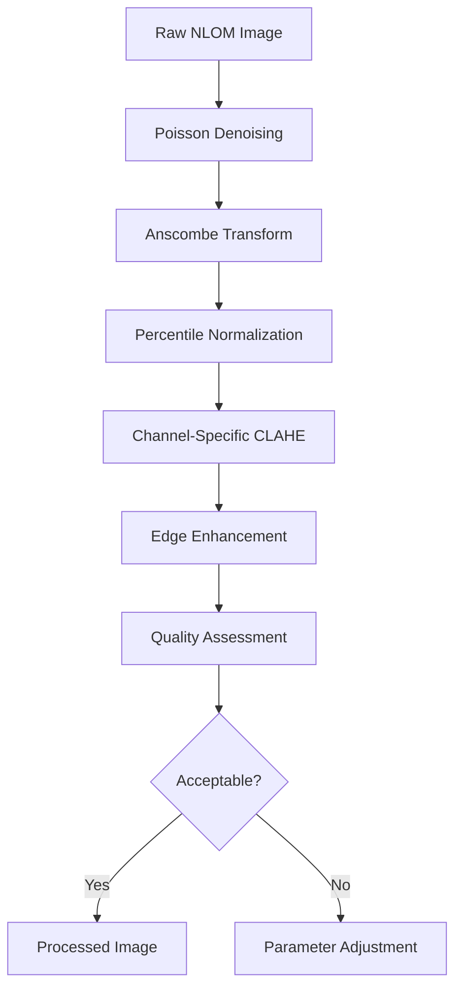

# Integrated Preprocessing Model for NLOM Thyroid Imaging

## Key Components
1. **Adaptive Normalization**
   - Per-channel percentile calculation
   - Dynamic range adjustment based on tissue type
2. **Multiscale CLAHE**
   - Pyramid-based tile size adaptation
   - Noise-adaptive clip limit
3. **Quality Control Loop**
   - Automated SSIM/CNR measurement
   - Feedback to normalization parameters